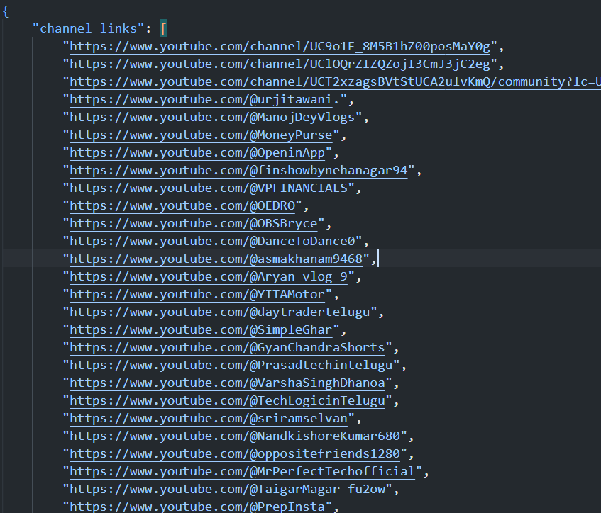

# SERP Crawler

A python script that searches a query on google search, collect all youtube links from results and find link to youtbe channels connected to them.

## Problem Statement

- Create a web crawler using python that is able to scrape first 10,000 results for the following
  google search input - site:youtube.com openinapp.co
- Collect all the given YouTube links of the above search link.
- Give the results in the JSON/CSV format.
  What we are looking for - Links should be of YouTube channel instead of scraping youtube video links.

# Prerequisites

- [Chrome WebDriver](https://chromedriver.chromium.org/downloads),
- [Selenium](https://pypi.org/project/selenium/).

## Implementation

The `main` function in `serp_crawler.py` initializes the webdriver and executed two functions

- `search_results` from `search.py` that search for the given query for first 10000 results and return a list of youtube video links, post links and channel links that appears in the search results.
- `get_channel_links ` from `channels.py `that get the channel links from the video links and post links and save them to a JSON file.

To further understand the code and see its functionality, watch the demo video: [DEMO_VIDEO](https://drive.google.com/file/d/1_OcOtcXggo4ivctVbLDcOXAcRPfS9zcE/view?usp=sharing)

## Setting Up

1. Run command - pip install -r requirements.txt

Note: This program is made to run on Windows. If you want to run the code in linus, download the linus chromedriver from [Chrome WebDriver](https://chromedriver.chromium.org/downloads) and save it in place of current chromedriver. Then in serp_crawler.py change the path "./chromedriver" to "./chromedriver.exe".

Note: It might happen that google might block you temporarily as this application sends a high amount of requests to google, then wait for some time before using the application again.

# Run Code

Then to execute code run command - python3 serp_crawler.py

It will start search for linksa and then displays them.

After that all channel links are saved in youtube_links.json file.

